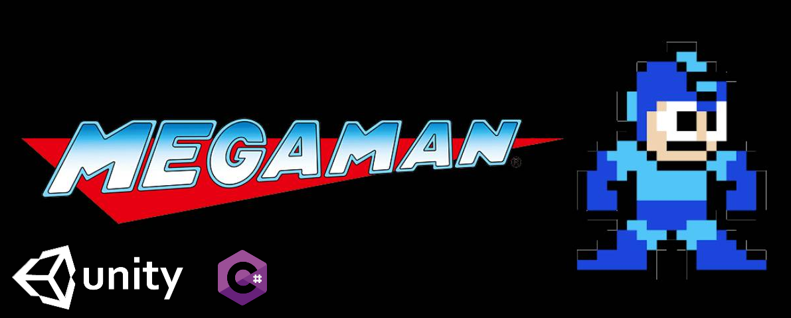

  
  
  
  

    
# Table Of Contents
  - [About](#about)
  - [How To Play](#how-to-play)
  - [Screenshots](#screenshots)
  - [Credits](#credits)

  # About
  
  The project was made as part of the "Game Dev Foundations" Course of The Hebrew University of Jerusalem &  Bezalel Academy of Arts and Design.
    
  The assignment was to remake one game from the 80s' using Unity, and i chose the NES game Mega-Man 2 which i was a fond of as a child.
    
  This remake consists of 2 levels - a remake to the level "Wood Man" from the original game, followed by a self-designed level.
 
  
  # How To Play
   
  - Left/Right - Move
  - X - Shoot
  - Space - Jump
    
  # Screenshots
  
  

      
               
    
               

    
  

  # Credits
    
  Sprites - [Sprite-Resource](https://www.spriters-resource.com/nes/mm2/)
    
  Sounds - [Sounds-Resource](https://www.sounds-resource.com/nes/megaman2/sound/3616/)
  
  

